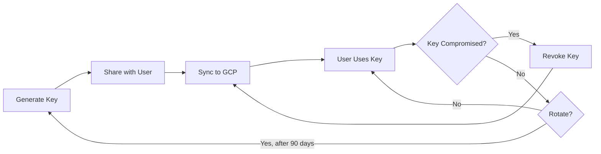

# Quick Start: API Key Management

## TL;DR - Getting Started in 5 Minutes

### 1. Create your first API key

```bash
cd /home/javiator/work/projects/tenant-management/tenant-management-mcp
python scripts/manage_keys.py generate --name "My First Key"
```

**Output:**
```
✅ New API key generated:
   ID:   a1b2c3d4
   Name: My First Key
   Key:  mcp_vXY7Kp9Lm3Qr8Wz4Nt6Jh2Fg5Cd1As0

⚠️  Save this key securely - it won't be shown again!
```

**Copy the key starting with `mcp_`** - you'll need it!

---

### 2. Upload keys to Google Cloud

```bash
# Authenticate with GCP (first time only)
gcloud auth login
gcloud config set project YOUR_PROJECT_ID

# Sync keys to Secret Manager
python scripts/manage_keys.py sync-to-gcp
```

---

### 3. Use the key with your MCP client

**For Claude Desktop**, add to config:
```json
{
  "mcpServers": {
    "tenant-management": {
      "url": "https://your-mcp-server.run.app",
      "transport": {
        "type": "http",
        "headers": {
          "X-API-Key": "mcp_vXY7Kp9Lm3Qr8Wz4Nt6Jh2Fg5Cd1As0"
        }
      }
    }
  }
}
```

**For testing with curl:**
```bash
curl -H "X-API-Key: mcp_vXY7Kp9Lm3Qr8Wz4Nt6Jh2Fg5Cd1As0" \
     https://your-mcp-server.run.app/health
```

---

## Common Commands

```bash
# List all keys
python scripts/manage_keys.py list

# Show full key (if user lost it)
python scripts/manage_keys.py show a1b2

# Revoke a key
python scripts/manage_keys.py revoke a1b2c3d4

# Sync changes to GCP (always do this after generate/revoke!)
python scripts/manage_keys.py sync-to-gcp
```

---

## Where are keys stored?

- **Locally:** `.keys.json` in project root (git-ignored)
- **In GCP:** Secret Manager secret named `mcp-api-keys`
- **Backup:** You should backup `.keys.json` to encrypted storage!

---

## Key Lifecycle



---

## Full Documentation

- **Complete Guide:** [docs/KEY_MANAGEMENT.md](KEY_MANAGEMENT.md)
- **Script Details:** [scripts/README.md](../scripts/README.md)
